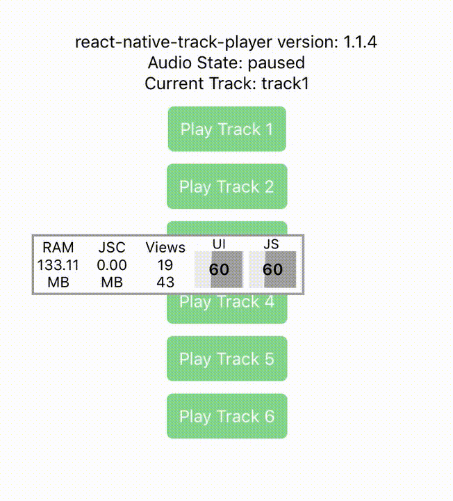
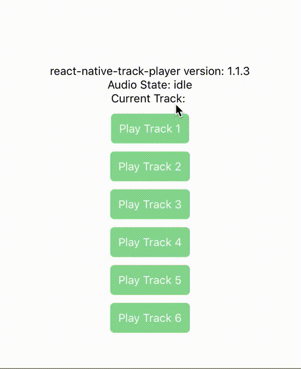

This is a simplified repro for the [react-native-track-player issue 548](https://github.com/react-native-kit/react-native-track-player/issues/548)

#### Installation

```
yarn
react-native link
yarn start
```

1.1.4 has a bug where reseting and adding new audio causes the UI thread performance to drop and anything on the screen to freeze until the buffering is done. You can see this by noticing how the touchable opacity freezes and doesn't return to opacity 1 until the buffering is done and the audio is ready to be played.



1.1.3 doesn't have this bug:

